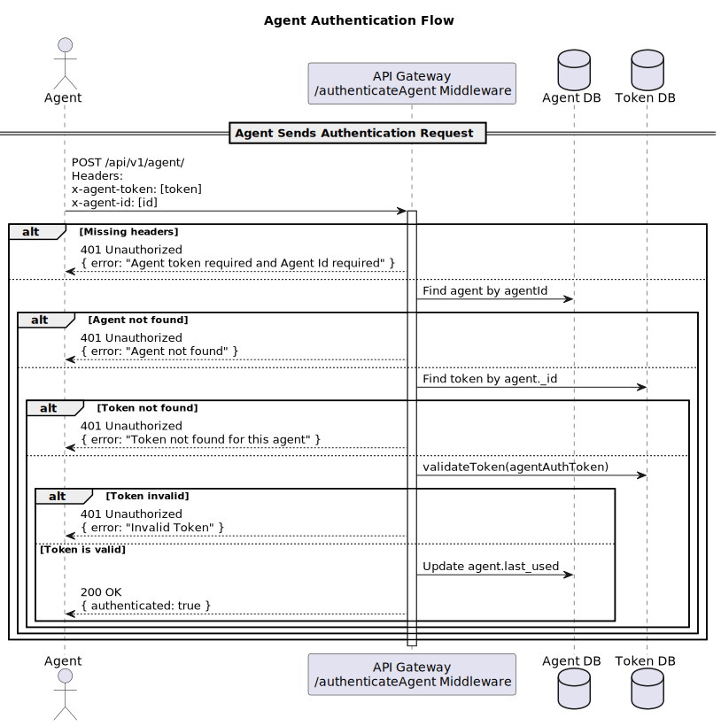

# AD Agent:
An agent is a piece of software that can be run on a server or a computer. This agent will be able to perform multiple security checks and scans on a company's network. The agent will begin its journey by performing a reconnaissance phase. It will start exploring the company's network to map the network environment (available hosts, their operating systems, general information, open ports, exposed services, etc.). By doing so, the agent will generate a full topology of the network it is part of (essentially creating a map of the network).

The agent will be configured using a config file that the user can generate from the user dashboard. This config file will contain important settings needed by the agent to perform its mission (for example, an Active Directory account, specific LDAP requests, regular expressions, network range, etc.). After gathering information about its surroundings, the agent will be able to load different security checks and scan modules on-demand. Each module will produce results (collected data, obtained security test results, etc.), which will be sent to the backend server using a specific API endpoint. This will be handled by the forwarder section of the agent, which is essentially a part of the agent responsible for sending raw JSON data to the backend server using the HTTP protocol.
The security checks and scans performed by the agent will include:
Different Active Directory attack scans (Kerberoasting, AS-REP Roasting, Resource Constrained Delegation, ACL (Access Control List) misconfigurations, Active Directory Certificate Services misconfigurations (Microsoft PKI “Public Key Infrastructure”)).
Common vulnerability scanning.
Scanning for exposed/shared files containing sensitive data (these files could be shared in a network environment using different protocols such as SMB, FTP/TFTP, SharePoint, etc.).
Performing audits to ensure compliance with standard security measures.

# Dev
poetry add --dev pytest black mypy

# Tests
poetry run pytest --cov=my_package --cov-report=term-missing

# Docs
poetry run sphinx-apidoc -o docs/source src/
poetry run make -C docs html

# Run The Agent:

~~~bash
poetry run python .\main.py -s module1,module2,module3,...
## Example:
poetry run python .\main.py -s recon,ldap,ftp
~~~

##  For Demo:
~~~bash
poetry run python .\main-demo.py -s module1,module2,module3,...
## Example:
poetry run python .\main-demo.py -s recon,ldap,ftp
~~~

## Agent Auth Process:

